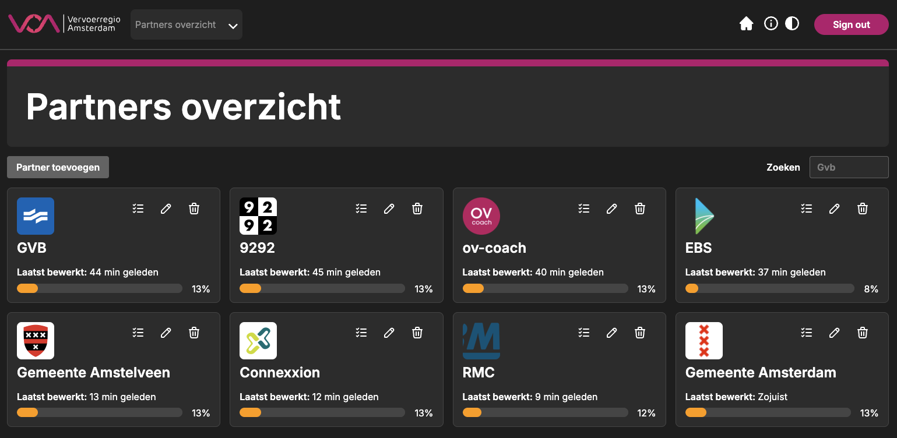

# Vervoerregio Amsterdam | Toolgankelijk

Live link: [http://toolgankelijk.agency.fdnd.nl/](http://toolgankelijk.agency.fdnd.nl/)

## Inhoudsopgave

- [Beschrijving](#beschrijving)
- [Kenmerken](#kenmerken)
- [Installatie](#installatie)
- [Projectteam 2025](#projectteam-2025)
- [Bronnen](#bronnen)
- [Licentie](#licentie)

## Beschrijving


De Vervoerregio Amsterdam verbindt gemeenten en werkt aan een regio waar mensen vlot hun bestemming bereiken. De gemeenten Aalsmeer, Amstelveen, Amsterdam, Diemen, Edam-Volendam, Haarlemmermeer, Landsmeer, Oostzaan, Ouder-Amstel, Purmerend, Uithoorn, Waterland, Wormerland en Zaanstad vormen samen de Vervoerregio Amsterdam. Vanaf 1 januari 2022 zijn gemeente Beemster en gemeente Purmerend samengegaan en bestaat de Vervoerregio sindsdien uit veertien gemeenten.

De Vervoerregio is opdrachtgever van het openbaar vervoer per bus, tram en metro. Hiervoor verlenen ze concessies aan vervoerbedrijven en subsidie voor de exploitatie van het openbaar vervoer. Ook investeren ze in nieuwe trams en metro’s.

Toolgankelijk is een interne webapplicatie ontwikkeld voor de Vervoerregio Amsterdam en haar partners. Met deze tool kunnen zowel medewerkers van de Vervoerregio als medewerkers van partnerorganisaties eenvoudig de digitale toegankelijkheid van partnerwebsites beoordelen en monitoren. De applicatie biedt een centraal overzicht van alle partners, inzicht in de status van hun websites op het gebied van toegankelijkheid, en ondersteunt het gezamenlijk werken aan een toegankelijke digitale omgeving.



## Kenmerken

Dit project is ontwikkeld door middel van SvelteKit. De inhoud wordt opgehaald uit Hygraph door middel van GraphQL queries.

De applicatie wordt gehost via Netlify, waarbij automatische deploys plaatsvinden bij wijzigingen in de branch. Versiebeheer vindt plaats in deze repository op GitHub.

Daarnaast is er een tweede repository waarin de backend-code voor de auditlogica van partners wordt beheerd. De audit-functionaliteit communiceert met deze externe audit-backend via een API.

Authenticatie en sessiebeheer zijn geïmplementeerd, inclusief e-mailverificatie. De applicatie is ontwikkeld met aandacht voor digitale toegankelijkheid (WCAG) en maakt gebruik van moderne webtechnieken zoals component-based development (Svelte) en GraphQL voor data queries.

Wij hebben de volgende technieken en technologiën gebruikt:

- [Svelte](https://svelte.dev/docs/svelte/overview)
- [SvelteKit](https://svelte.dev/docs/kit/introduction)
- [Hygraph](https://hygraph.com/)
- [GraphQL](https://graphql.org/)
- [Figma](https://www.figma.com/design/djc9IttXBpRtzImK5Wxiwv/Vervoerregio-Amsterdam?node-id=0-1&t=8dC9foJZof3EOqEf-1)
- [Netlify](https://www.netlify.com/)
- [Nodemailer](https://nodemailer.com/)

## Installatie

```
1. Clone de repository
2. Open de repo in een IDE
3. Installeer npm packages d.m.v. npm install
4. Maak een `.env` bestand aan in de root van het project en vul de benodigde variabelen in (zie `example.env` voor de juiste namen en structuur)
5. Run de localhost d.m.v. npm run dev
```

## Projectteam 2025

- [Bjarne](https://github.com/bzschool) – Backend developer
- [Ilias](https://github.com/iliasworldpeace) – Designer
- [Mats](https://github.com/MatsvdZ) – Designer
- [Mohammed](https://github.com/Mossati) – Frontend developer

## Bronnen

[FDND agency](https://github.com/fdnd-agency/vervoerregio-amsterdam) <br>
[Hygraph mutation](https://hygraph.com/docs/api-reference/content-api/mutations) <br>
[Email verificatie setup met Nodemailer](https://www.youtube.com/watch?v=qa-Sh0iM-kM)<br>

## Licentie

This project is licensed under the terms of the [MIT license](./LICENSE).
