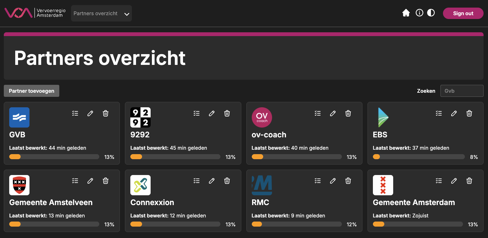

# Vervoerregio Amsterdam | Toolgankelijk


Live link: [http://toolgankelijk.agency.fdnd.nl/](http://toolgankelijk.agency.fdnd.nl/)

## Contents

- [Description](#description)
- [Features](#features)
- [Design Choices](#design-choices)
- [Datamodel](#datamodel)
- [Installation](#installation)
- [Projectteam 2026](#projectteam-2026)
- [Sources](#sources)
- [Licence](#licence)

## Description

Vervoerregio Amsterdam connects munancipilities and works on a ragion where people can achieve their destination easily. The municipalities Aalsmeer, Amstelveen, Amsterdam, Diemen, Edam-Volendam, Haarlemmermeer, Landsmeer, Oostzaan, Ouder-Amstel, Purmerend, Uithoorn, Waterland, Wormerland, Beemster, Purmerend en Zaanstad together forms Vervoerregio Amsterdam. Vervoerregio Amsterdam exist out of 14 munancipilities.

Vervoerregio is a client of the public transportation per bus, tram, metro.

Toolgankelijk is an ongoing project at FDND-agency that has been developed by alternating teams since 2023. Within this project, a website with an audit tool has been developed, allowing partners of Vervoer Regio Amsterdam to test their websites for accessibility according to EAA legislation.

With the application you can run a performance audit, to check the status of your website. After you run the test it you will see the results of the automatically tests. There are some audits you have to check manually. There is a second [repositry](https://github.com/fdnd-agency/toolgankelijk-audit). When you need to run a performance audit make sure you run this in the background.



## New Features

Since the last sprint review there are several changes in the application. We recognised that the design was bugging a lot so we simplified the code. Lots of code and component are refactored now. The header is simplified where you can navigate through all pages (info, account and partner overview). 


**Header**

The header has a update it is simplified and the logo of the header is responsive. It solves the bug of displaying the wrong colors in the design. Also there is an account page where you can logout when you are on that page. It also includes a hamburger button

**Darkmode**

The dark mode has been removed due to the soft launch that is coming up. This is a unnecesary function and collapse between the old and new design. The color system is still used.

**Consistent icons**

The icons are imported as svelte components and are all consistent, this can be added to the nav button or loose in the design.


**NavButtons**

The NavButtons is a component that can be used for navigation to a page or a button. It is build up out of a svelte element which can be defined with a link or a onclick function.

**Design Overhaul**


The application has seen a major design overhaul in different areas. The toolboard has been overhauled with new colors, better contrast levels and a more consistent look.  Also, a new subheader has been added to make navigation more intuitive and responsive.  

## New Design

One of the epics of this project is to implent the new design over the old design which is working fully on the Responsive, Accesbillity, Perfromance and Progressive Enhancement principles. The styleguide we use for the design is imported from this [styleguide](https://github.com/fdnd-agency/toolgankelijk/blob/main/Vervoerregio%20Handboek_Huisstijl_v5_2025_LR.pdf).

## Datamodel 

Maksim text

## Installation

```
1. Clone de repository
2. Open de repo in een IDE
3. Installeer npm packages d.m.v. npm install
4. Maak een `.env` bestand aan in de root van het project en vul de benodigde variabelen in (zie `example.env` voor de juiste namen en structuur)
5. Run de localhost d.m.v. npm run dev
```

## Projectteam 2026

- [Maksim](https://github.com/MaksimH2O) – Backend Developer
- [Rick](https://github.com/RickFDND) - Frontend Developer
- [Miel](https://github.com/miel775) - Frontend Developer

## Sources 💡

- [Svelte](https://svelte.dev/docs/svelte/overview)
- [FDND agency](https://github.com/fdnd-agency/vervoerregio-amsterdam)
- [Email verificatie setup met Nodemailer](https://www.youtube.com/watch?v=qa-Sh0iM-kM)
- [SvelteKit](https://svelte.dev/docs/kit/introduction)
- [Directus](https://directus.io/docs/)
- [Figma](https://www.figma.com/design/AcoAfiRyevwqXLmdBrbxtG/Toolgankelijk?node-id=18-42&t=vePCwpOn8RYkWthI-1)
- [Netlify](https://www.netlify.com/)
- [Atomic Design System](https://atomicdesign.bradfrost.com/chapter-2/)

## License

This project is licensed under the terms of the [MIT license](https://www.notion.so/LICENSE).
