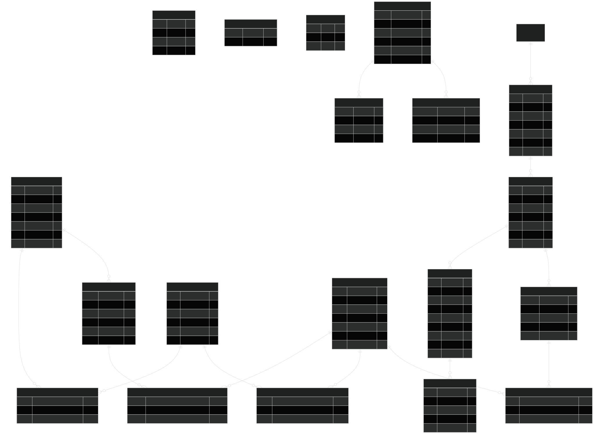

# Vervoerregio Amsterdam | Toolgankelijk


## Contents

- [Description](#description)
- [Features](#features)
- [Design Choices](#design-choices)
- [Datamodel](#datamodel)
- [Installation](#installation)
- [Projectteam 2026](#projectteam-2026)
- [Sources](#sources)
- [Licence](#licence)

## Description

Vervoerregio Amsterdam connects munancipilities and works on a ragion where people can achieve their destination easily. The municipalities Aalsmeer, Amstelveen, Amsterdam, Diemen, Edam-Volendam, Haarlemmermeer, Landsmeer, Oostzaan, Ouder-Amstel, Purmerend, Uithoorn, Waterland, Wormerland, Beemster, Purmerend en Zaanstad together forms Vervoerregio Amsterdam. Vervoerregio Amsterdam exist out of 14 munancipilities.

Vervoerregio is a client of the public transportation per bus, tram, metro.

Toolgankelijk is an ongoing project at FDND-agency that has been developed by alternating teams since 2023. Within this project, a website with an audit tool has been developed, allowing partners of Vervoer Regio Amsterdam to test their websites for accessibility according to EAA legislation.

With the application you can run a performance audit, to check the status of your website. After you run the test it you will see the results of the automatically tests. There are some audits you have to check manually. There is a second [repositry](https://github.com/fdnd-agency/toolgankelijk-audit). When you need to run a performance audit make sure you run this in the background.


## Design System


Due to implenting the new design, we proposed the design system according the atomic design. The design system is made out of the Atomic Design where templates are build out of a hierarchy of components this is divided by: Atoms, Molecules, Organisms and Templates. 

These are the components that are made inside the design system

Atoms
- Icons
- Logo
- Seperator

Molecules
- Alert
- Checkbox
- Heading
- Input
- Loader
- NavButton
- Progressbar
- Search

Organisms
- Breadcrumbs
- HamburgerMenu
- Pages

Templates
- Header
- Card
- Checklist
- Dialog
- Sidebar
- SubHeader

The components are all composiitions of the code which can be reused everytime. The information will be loaded on each pages.

## New Features

Since the last sprint review there are several changes in the application. We recognised that the design was bugging a lot so we simplified the code. Lots of code and component are refactored now. The header is simplified where you can navigate through all pages (info, account and partner overview). 

**Subheader**


In the subheader you will find the breadcrumbs which were in the header first. This was first placed in the header. You can navigate here through different urls and partners. You can also add a partner/url to the page with the add button. You can also search for the url/partners with the search tool in the right corner.

The subheader will be disabled on the principles page cause there only will be the filter function as a sidebar. On the subheader here is only the navigate back to the url oversight button.

**Login and Accountpage**


The application has seen a major design overhaul in different areas. The toolboard has been overhauled with new colors, better contrast levels and a more consistent look.  Also, a new subheader has been added to make navigation more intuitive and responsive.  

**Checklist and Audit Running**

## Datamodel 

<a href="docs/ERD.svg">
  
</a>

Full size: [`docs/ERD.svg`](docs/ERD.svg)

Source: [`docs/ERD-public.mmd`](docs/ERD-public.mmd)


## Installation

```
1. Clone de repository
2. Open de repo in een IDE
3. Installeer npm packages d.m.v. npm install
4. Maak een `.env` bestand aan in de root van het project en vul de benodigde variabelen in (zie `example.env` voor de juiste namen en structuur)
5. Run de localhost d.m.v. npm run dev
```

## Projectteam 2026

- [Tom] - CMD student
- [Maksim](https://github.com/MaksimH2O) – Backend Developer
- [Rick](https://github.com/RickFDND) - Frontend Developer
- [Miel](https://github.com/miel775) - Frontend Developer

## Sources 💡

- [Svelte](https://svelte.dev/docs/svelte/overview)
- [FDND agency](https://github.com/fdnd-agency/vervoerregio-amsterdam)
- [Email verificatie setup met Nodemailer](https://www.youtube.com/watch?v=qa-Sh0iM-kM)
- [SvelteKit](https://svelte.dev/docs/kit/introduction)
- [Directus](https://directus.io/docs/)
- [Figma](https://www.figma.com/design/AcoAfiRyevwqXLmdBrbxtG/Toolgankelijk?node-id=18-42&t=vePCwpOn8RYkWthI-1)
- [Netlify](https://www.netlify.com/)
- [Atomic Design System](https://atomicdesign.bradfrost.com/chapter-2/)

## License

This project is licensed under the terms of the [MIT license](https://www.notion.so/LICENSE).
